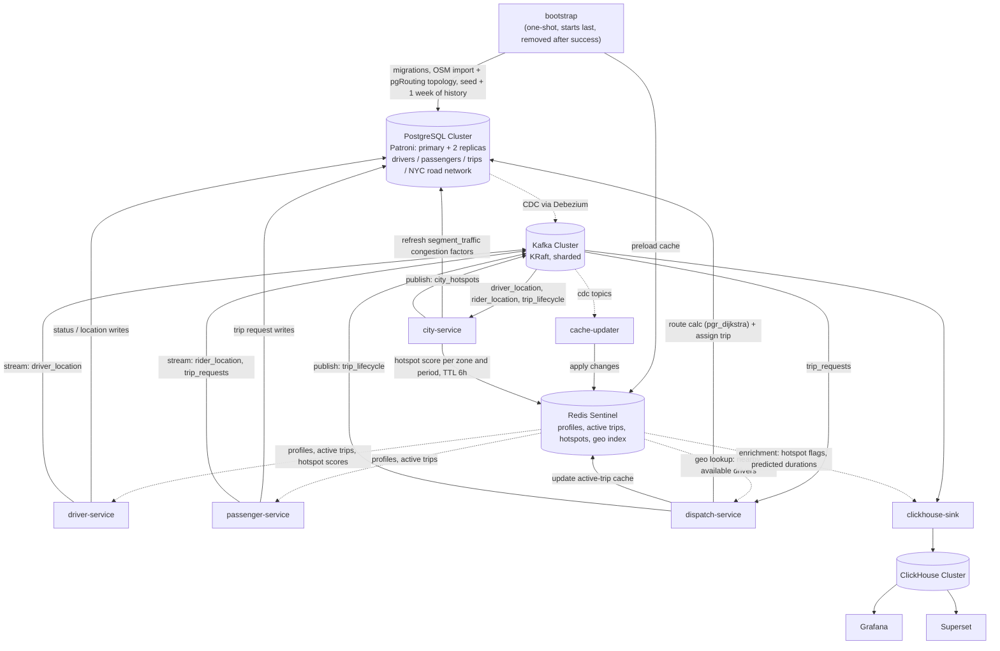
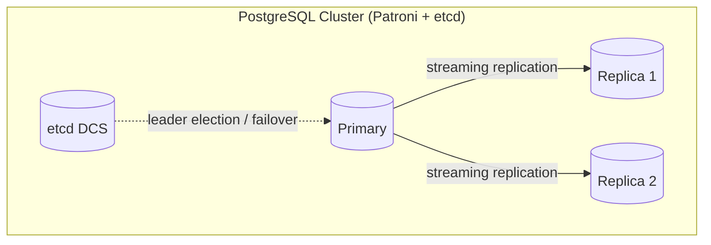
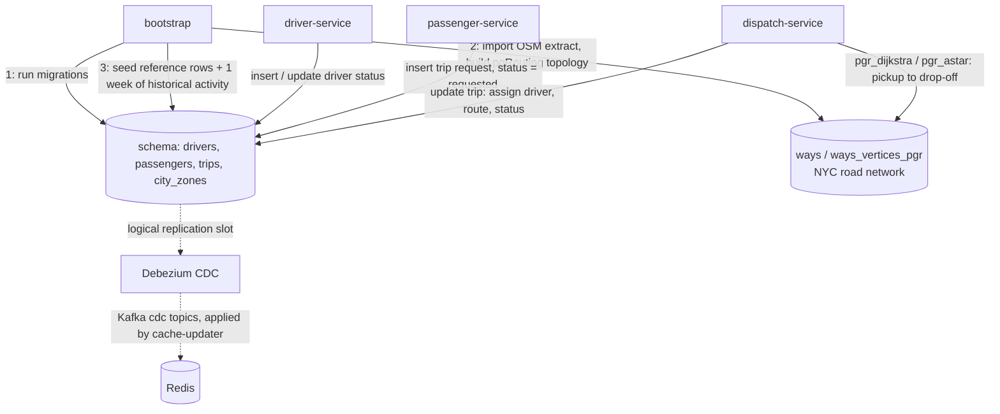
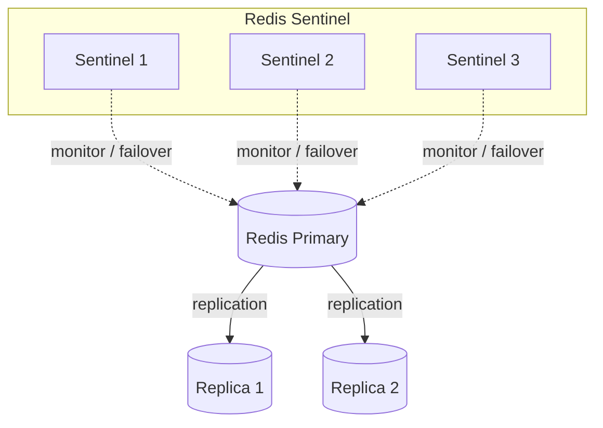
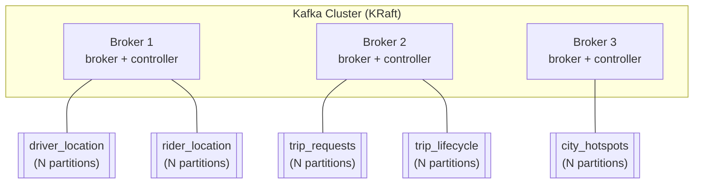
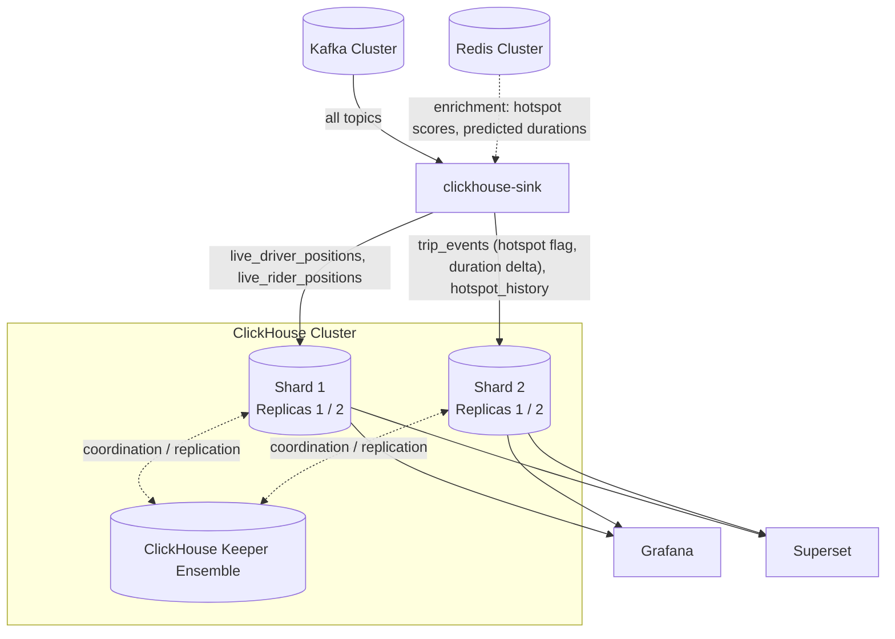

# Meanul Data Studio

## 1. About Meanul Data Studio

Meanul Data Studio is a framework for simulating the **full backend data
lifecycle of an online platform**, end to end, packaged as a set of Docker
containers and run via a single `docker-compose.yml` on a single host.

Each "version" of the studio applies the same architectural pattern to a
different product domain — for example a cab/ride-hailing platform, a
music/video streaming platform (Spotify/Netflix-like), a flight-booking /
airport platform, and so on. The studio is designed to host **multiple such
versions over time**; the pattern itself is domain-agnostic:

- **Synthetic data generation** — All activity (users, drivers, listeners,
  trips, plays, bookings, etc.) is produced by services built with the
  [Faker](https://faker.readthedocs.io/) library, generating realistic,
  internally-consistent records rather than arbitrary random values.
  Generation pacing (volume, rate, time-of-day/weekday/seasonal weighting)
  is config-driven.
- **OLTP layer (PostgreSQL)** — The single source of truth for operational
  state (e.g. driver/passenger/trip tables): a solid, transactional
  database that generators write to. Semi-structured / JSON-like payloads
  are stored natively in PostgreSQL **`JSONB`** columns — no separate
  document database (e.g. MongoDB) is introduced for them.
- **Cache layer (Redis, Sentinel-managed)** — Sits in front of the OLTP
  layer as the **read path for everything else**. ClickHouse-feeding
  consumers and other mimic services must never query the PostgreSQL OLTP
  cluster directly for joins/lookups — they read from Redis instead. When
  data in PostgreSQL changes, the change is captured via **CDC (Debezium
  over Kafka)** and applied to the cache, keeping Redis consistent with
  the source of truth.
- **Streaming backbone (Kafka cluster, KRaft mode)** — A sharded,
  multi-broker Kafka cluster running in KRaft mode (no ZooKeeper).
  Generators and/or the OLTP layer publish events onto Kafka topics.
- **OLAP layer (ClickHouse, ClickHouse Keeper)** — A sharded/replicated
  ClickHouse cluster fed from Kafka, coordinated via a ClickHouse Keeper
  ensemble (no ZooKeeper dependency).
- **Dashboards** — [Grafana](https://grafana.com/) for live/operational
  views and [Apache Superset](https://superset.apache.org/) for analytical
  BI dashboards, both backed by ClickHouse.

Every component, including the Python generator services, runs inside its
own Docker container — there is no host-level virtual environment; any
Python `venv`s live entirely inside the container images.


## 2. Version 1 — Cab / Ride-Hailing Platform

Version 1 simulates an online cab/ride-hailing platform: drivers and
passengers, trip requests, real-time location streaming during a trip, real
routes over the NYC street network, dynamic demand "hotspots", and the
analytics built on top of all of the above.

### 2.1 Services

The platform is split into one **one-shot init service** and several
**long-running services**, each its own container:

| Service | Type | Responsibility |
| --- | --- | --- |
| `bootstrap` | one-shot | Runs DB migrations, imports the NYC OSM road network into PostgreSQL and builds the pgRouting topology, seeds initial reference data (drivers, passengers, city zones), and generates **one week of historical mock activity** (trips, locations, per-segment traffic) so the ecosystem starts with a realistic baseline. Exits and is removed when done. |
| `driver-service` | long-running | Simulates the pool of active drivers (not one container per driver — one service internally manages many simulated drivers). Produces driver status/location activity. |
| `passenger-service` | long-running | Simulates the pool of riders. Produces trip requests and rider device location streams. |
| `dispatch-service` | long-running | Matches trip requests from `passenger-service` to available drivers, computes the route via pgRouting, and assigns the trip. |
| `city-service` | long-running | Watches live trip/location traffic, computes per-zone demand "hotspot" scores and per-road-segment congestion factors (refreshing `segment_traffic` used by routing), and publishes hotspots so drivers can be guided toward demand. |
| `clickhouse-sink` | long-running | Consumes Kafka topics, enriches events via Redis, and writes into the ClickHouse cluster for analytics/dashboards. |
| `cache-updater` | long-running | Consumes the Debezium CDC topics and applies PostgreSQL changes to Redis, keeping the cache in sync with the source of truth. |

Note: in the real world, driver-side and rider-side telemetry are **not**
1:1 mirrors of each other (different devices, different sampling rates,
different failure modes) — `driver-service` and `passenger-service` are
independent generators that happen to refer to the same trips, not a single
simulation duplicated into two streams.

#### Container startup procedure

`docker-compose up` brings the stack up in a strict order, enforced through
healthchecks and `depends_on: condition: service_healthy`:

1. **Infrastructure clusters** start first: PostgreSQL (Patroni-managed),
   Redis + Sentinel, Kafka (KRaft) + Debezium Connect, ClickHouse + Keeper,
   Grafana, Superset — each with a healthcheck.
2. **Long-running app services** (`driver-service`, `passenger-service`,
   `dispatch-service`, `city-service`, `clickhouse-sink`, `cache-updater`)
   start once the infrastructure they depend on is healthy, and wait in
   standby until the data layer is initialized.
3. **`bootstrap` is the last container to come up**, gated on every other
   service being healthy. It runs migrations, imports the NYC OSM extract
   and builds the pgRouting topology, seeds initial drivers/passengers/city
   zones, generates one week of historical mock activity (including
   per-segment traffic baselines), preloads the cache, then exits
   successfully and is removed.
4. Once `bootstrap` has completed, the standby app services detect the
   initialized data layer and begin generating live activity; from this
   point the whole ecosystem runs purely from its configuration.

### 2.2 High-level overview (HLD)



### 2.3 PostgreSQL cluster (HLD)

PostgreSQL is the system of truth for all transactional/operational state
and the NYC road network graph. It runs as a real cluster — **one primary +
two streaming replicas with automatic failover managed by Patroni** (backed
by an etcd DCS) — and relies on three pillars:

- **[PostGIS](https://postgis.net/)** — the extension that stores the NYC
  map: road geometries, pickup/drop-off points, and route linestrings live
  in `geometry` columns with GiST spatial indexes.
- **[pgRouting](https://pgrouting.org/)** — the extension that turns the
  map into a routable graph and finds the best path for each trip
  (see [2.7](#27-nyc-road-network--routing) for the traffic-aware cost
  model).
- **`JSONB`** — all JSON-like / semi-structured payloads (device metadata,
  event payloads, flexible trip attributes) are stored in native `JSONB`
  columns with GIN indexes where needed — PostgreSQL covers the
  document-store role, so no MongoDB is part of the stack.





Core tables (conceptual):

- `drivers` — driver profile + current status (offline/idle/en-route/on-trip);
  device/vehicle metadata in `JSONB`.
- `passengers` — passenger/rider profile; preferences/device metadata in
  `JSONB`.
- `trips` — pickup point, drop-off point (PostGIS points), assigned driver,
  computed route geometry (PostGIS linestring), predicted duration, status,
  timestamps; flexible attributes in `JSONB`.
- `city_zones` — NYC zone/grid definitions used for hotspot aggregation.
- `segment_traffic` — per-road-segment congestion factors: baseline from the
  bootstrap-seeded historical week, continuously refreshed by `city-service`
  from live streams; consumed by pgRouting as edge-cost multipliers.
- `ways` / `ways_vertices_pgr` — pgRouting topology built from the NYC OSM
  extract (see [2.7](#27-nyc-road-network--routing)).

### 2.4 Redis cluster (HLD)

Redis runs as a Sentinel-managed primary/replica set and is the **only**
read path for cached reference and hot-path data — generators, dispatch,
the city service, and the ClickHouse sink read from here, never directly
from PostgreSQL.



Key spaces (conceptual):

| Key pattern | Written by | Read by | Notes |
| --- | --- | --- | --- |
| `driver:{id}` | `cache-updater` (CDC) | `driver-service`, `dispatch-service`, `clickhouse-sink` | profile + current status |
| `passenger:{id}` | `cache-updater` (CDC) | `passenger-service`, `dispatch-service`, `clickhouse-sink` | profile |
| `trip:{id}:active` | `dispatch-service` | `driver-service`, `passenger-service`, `clickhouse-sink` | active-trip state incl. route + predicted duration |
| `geo:drivers:available` | `driver-service` | `dispatch-service` | Redis GEO set for nearest-driver lookup |
| `hotspot:{zone}:{period}` | `city-service` | `driver-service`, `clickhouse-sink` | demand score, **TTL = 6h** (24h split into 4 periods) |

### 2.5 Kafka cluster (HLD)

Kafka runs as a sharded, multi-broker cluster in **KRaft mode** (combined
broker/controller nodes, no ZooKeeper).



| Topic | Producer | Consumer(s) |
| --- | --- | --- |
| `driver_location` | `driver-service` | `city-service`, `clickhouse-sink` |
| `rider_location` | `passenger-service` | `city-service`, `clickhouse-sink` |
| `trip_requests` | `passenger-service` | `dispatch-service`, `clickhouse-sink` |
| `trip_lifecycle` | `dispatch-service` | `city-service`, `clickhouse-sink` |
| `city_hotspots` | `city-service` | `clickhouse-sink` |
| `cdc.*` (per table) | Debezium Connect (from PostgreSQL WAL) | `cache-updater` |

### 2.6 ClickHouse cluster (HLD)

ClickHouse runs as **2 shards x 2 replicas** coordinated by a **3-node
ClickHouse Keeper ensemble** (no ZooKeeper) — sharding and replication are
both demonstrated at a footprint that fits a single host. `clickhouse-sink`
consumes every Kafka topic above and writes into denormalized analytics
tables that back Grafana (live/ops) and Superset (BI).

**Relationship with the Redis cluster:** before inserting, the sink
enriches events using Redis-cached state — for example, when a completed
trip arrives it looks up `hotspot:{zone}:{period}` to mark whether it was a
**hotspot trip**, and compares the actual duration against the predicted
duration cached on `trip:{id}:active` to flag trips that **took longer than
predicted** so Grafana can surface them. This keeps all such lookups off
the PostgreSQL OLTP cluster, per the cache-first rule in Section 1.



### 2.7 NYC road network & routing

The PostgreSQL OLTP database holds the NYC street network as a routable
graph, used to compute a real route (pickup -> drop-off) for every trip.
The map is stored by the **PostGIS** extension and routed by the
**pgRouting** extension:

- **Source data**: an OpenStreetMap extract for New York City (e.g. via
  Geofabrik or the OSM Overpass API), which provides accurate, freely
  licensed street geometry and metadata for the full road network.
- **Loading**: the `bootstrap` service imports the OSM extract into
  PostgreSQL/**PostGIS** and converts it into a routable topology using
  `osm2pgrouting` (or `osm2pgsql` + pgRouting's topology functions),
  producing the standard pgRouting `ways` / `ways_vertices_pgr` tables.
- **Traffic-aware best path**: routing does not use raw geometric distance
  alone. Each road segment's cost is its base travel time (length /
  segment speed) multiplied by a **congestion factor** from the
  `segment_traffic` table. The baseline factors come from the week of
  historical activity seeded by `bootstrap`; from then on `city-service`
  continuously recomputes them from the live `driver_location` /
  `rider_location` streams. The same trip can therefore get a different
  "best" route at rush hour than at 3 AM.
- **Routing**: for each trip, `dispatch-service` calls pgRouting
  (`pgr_dijkstra` or `pgr_astar`) with the traffic-weighted edge costs to
  compute the best path between the pickup and drop-off vertices; the
  resulting route geometry (PostGIS linestring) and predicted duration are
  stored on the trip record. The predicted duration is what the
  `clickhouse-sink` later compares against actual duration to flag
  overrunning trips.
- **Indexing**: spatial indexes (GiST on geometry columns) and pgRouting's
  vertex/edge indexes are applied so route lookups remain fast as trip
  volume grows.

### 2.8 Project structure

Each version of the studio lives in its own top-level directory; Version 1
is `not-uber-service/` (fun naming intended). Future versions will sit next
to it as siblings.

Within `not-uber-service/`, every component directory under `infra/`,
`services/`, and the top-level `bootstrap/` carries an **alphabetic
build/test-order prefix** (`a-`, `b-`, `c-`, ...) shared across all three
locations — see [2.8.1](#281-build--test-order) for the full sequence and
the dependency reasoning behind it.

```
meanul-data-studio/
├── README.md
├── LICENSE
├── .gitignore
└── not-uber-service/       # Version 1 — cab / ride-hailing platform
    ├── docker-compose.yml  # single-host deployment of the full stack
    ├── c-bootstrap/        # one-shot init service (starts last, then removed)
    │   ├── migrations/     # SQL schema migrations
    │   ├── osm/            # NYC OSM extract download + osm2pgrouting setup
    │   └── seed/           # initial drivers/passengers/city_zones data
    ├── services/           # long-running Faker-based app services
    │   ├── f-cache-updater/   # CDC topics -> Redis
    │   ├── g-driver-service/
    │   ├── h-passenger-service/
    │   ├── i-dispatch-service/
    │   ├── k-clickhouse-sink/
    │   └── l-city-service/
    ├── infra/              # per-cluster configuration
    │   ├── a-postgres/     # Patroni (primary + 2 replicas) + etcd config
    │   ├── b-redis/        # Sentinel config
    │   ├── d-kafka/        # KRaft broker config, topic definitions
    │   ├── e-debezium/     # Kafka Connect + PostgreSQL CDC connector
    │   ├── j-clickhouse/   # cluster + Keeper config, table DDL
    │   ├── m-grafana/      # provisioned dashboards/datasources
    │   └── n-superset/     # provisioned datasets/dashboards
    └── docs/
        ├── clickhouse-cluster-design.md   # early cluster topology notes
        └── sketch/                        # superseded first-draft generator (reference only)
```

#### 2.8.1 Build & test order

The prefixes encode a single dependency-driven sequence across the whole
stack, so each piece can be written and tested in isolation before the next
depends on it:

| Step | Component | Why this point in the sequence |
| --- | --- | --- |
| `a-` | `infra/a-postgres` | Foundation: schema, PostGIS/pgRouting extensions, Patroni cluster — testable standalone with raw SQL. |
| `b-` | `infra/b-redis` | Sentinel cache cluster — testable standalone (set/get, failover) before anything depends on it. |
| `c-` | `c-bootstrap` | Needs `a` + `b` running: migrations, OSM import/topology build, seed data, historical week, cache preload. |
| `d-` | `infra/d-kafka` | Streaming backbone — testable standalone (produce/consume) before any producer/consumer exists. |
| `e-` | `infra/e-debezium` | Needs `a` + `d`: CDC connector turning Postgres WAL into Kafka `cdc.*` topics. |
| `f-` | `services/f-cache-updater` | Needs `b` + `e`: consumes `cdc.*`, proves the cache-sync loop end-to-end. |
| `g-` | `services/g-driver-service` | Needs `a`, `b`, `d`, `f`: first activity generator — profiles, status, location stream. |
| `h-` | `services/h-passenger-service` | Same dependencies as `g`; built second since dispatch needs both. |
| `i-` | `services/i-dispatch-service` | Needs `g` + `h`: matching, pgRouting route calc, trip assignment. |
| `j-` | `infra/j-clickhouse` | OLAP cluster — testable standalone (DDL, inserts, replication) before the sink exists. |
| `k-` | `services/k-clickhouse-sink` | Needs `d`, `b`, `j`: Kafka -> Redis-enriched -> ClickHouse. |
| `l-` | `services/l-city-service` | Needs `d` + `b` (and benefits from `k` for validation): hotspot scoring, traffic factors. |
| `m-` | `infra/m-grafana` | Needs `j` + `k`: live/operational dashboards on real data. |
| `n-` | `infra/n-superset` | Needs `j` + `k`: BI dashboards on real data — last, since it benefits most from data already flowing. |

### 2.9 Resource allocation

The stack ships with two resource profiles, applied as docker-compose
override files on top of the base `docker-compose.yml`
(`compose.laptop.yaml` / `compose.server.yaml`), setting explicit
**memory and CPU limits** per container. Explicit limits are mandatory:
the JVM-based components (Kafka, Debezium Connect) and ClickHouse will
otherwise size themselves against all visible host RAM.

Two assumptions keep the budget realistic: generation pacing is configured
for **moderate volumes** (this is a simulation, not Uber-scale traffic),
and Grafana/Superset serve a **single dashboard user**.

Reference hosts:

| Profile | Hardware | CPU | RAM | Storage |
| --- | --- | --- | --- | --- |
| Laptop | MacBook Air (Apple M5) | 10 cores (4P + 6E) | 24 GB unified | 1 TB SSD |
| Server | Dedicated Docker host | 24 vCPU | 128 GB | 1 TB NVMe |

Storage is not a constraint on either host (see the capacity estimates
below — the stack produces low single-digit GB per day at laptop pacing).

#### Laptop profile (24 GB host, stack capped at ~14 GB steady / 16 GB Docker VM)

Docker Desktop VM settings for this profile: **8 CPUs, 16 GB memory,
swap = 0** (see the swap note below). macOS is itself memory-hungry, so
only 16 of the 24 GB are handed to Docker — a full 8 GB stays with the OS.
CPU limits sum to **7.75 of the VM's 8 CPUs — no overcommitment**.

| Component | Containers | CPU each | Mem each | Mem subtotal |
| --- | --- | --- | --- | --- |
| PostgreSQL primary (Patroni) | 1 | 1.0 | 1.25 GB | 1.25 GB |
| PostgreSQL replicas (Patroni) | 2 | 0.5 | 768 MB | 1.5 GB |
| etcd (Patroni DCS) | 1 | 0.1 | 256 MB | 0.25 GB |
| Redis primary / replicas | 1 / 2 | 0.4 / 0.2 | 512 MB / 384 MB | 1.25 GB |
| Redis Sentinel | 3 | 0.05 | 64 MB | 0.2 GB |
| Kafka brokers (KRaft) | 3 | 0.4 | 640 MB (448 MB heap) | 1.9 GB |
| Debezium Connect | 1 | 0.25 | 768 MB (512 MB heap) | 0.75 GB |
| ClickHouse nodes (2x2) | 4 | 0.5 | 1 GB | 4 GB |
| ClickHouse Keeper | 3 | 0.1 | 256 MB | 0.75 GB |
| Grafana | 1 | 0.1 | 256 MB | 0.25 GB |
| Superset (single user, single worker) | 1 | 0.25 | 768 MB | 0.75 GB |
| App services (driver, passenger, dispatch, city, sink, cache-updater) | 6 | 0.1 | 192 MB | 1.15 GB |
| **Steady-state total** | **29** | **7.75 (of 8, no overcommit)** | | **~14 GB** |
| `bootstrap` (transient, exits after init) | 1 | 1.0 | 1 GB | peak only |

Steady state plus the transient `bootstrap` peaks at ~15 GB, inside the
16 GB VM — about 5 GB under the original 20 GB ceiling. `bootstrap`'s
1.0 CPU also stays inside the envelope because it runs while the app
services are still in standby (near-zero usage). Key tuning that makes it
fit: `KAFKA_HEAP_OPTS` capped per broker, ClickHouse
`max_server_memory_usage` set below its container limit, PostgreSQL
`shared_buffers`/`work_mem` sized to its limit, and Superset running in
single-worker mode.

#### No-swap policy (macOS / Docker Desktop)

Docker on macOS runs inside a Linux VM, and swapping happens at two
levels; both are closed off:

1. **VM level** — Docker Desktop > Settings > Resources > **Swap = 0**
   (equivalently `"swapMiB": 0` in Docker Desktop's settings file). The VM
   then has no swap device at all.
2. **Container level** — every service in the compose profiles sets
   `memswap_limit` equal to its memory limit. Under Linux semantics
   memory+swap = memory, i.e. **zero swap per container**, regardless of
   VM settings — this also keeps the server profile honest on Linux hosts.

The consequence is deliberate: an undersized container gets **OOM-killed
and restarted** (visible in `docker ps`/restart counts) instead of
silently swapping and dragging the whole stack down.

#### Validating that the budget is enough

The limits are hard ceilings, so "does it fit?" is observable rather than
hoped for:

- **Live usage**: `docker stats` (or the Docker Desktop dashboard) shows
  per-container memory against its limit; anything pinned at its cap is a
  candidate for rebalancing.
- **OOM signals**: `docker inspect --format '{{.RestartCount}} {{.State.OOMKilled}}'`
  per container — any OOM kill means that component's limit or the pacing
  config must come down.
- **Pipeline health**: Kafka consumer-group lag (must stay bounded),
  ClickHouse ingestion delay, and Patroni/Sentinel/Keeper health checks.
- **Soak test**: after `bootstrap` completes, run the stack at target
  pacing for several hours and confirm all of the above stay flat. The
  pacing config is the relief valve — volumes are turned down in config,
  never by removing containers.

#### Capacity estimate at laptop pacing

The bottleneck is **not** Kafka or ClickHouse (at these limits they
comfortably handle thousands of messages/s and tens of thousands of
batched row inserts/s respectively). The realistic constraints are the
Python generators and, above all, **per-trip pgRouting computation** on
the NYC graph (~50–150 ms per `pgr_dijkstra`/`pgr_astar` call):

| Metric | Sustained estimate |
| --- | --- |
| Concurrent simulated drivers | ~500–1,000 |
| New trips (routed via pgRouting) | ~5–10 trips/s (~0.4–0.9 M trips/day) |
| Location events (driver + rider, every 2–5 s per device) | ~400–800 events/s (~35–70 M events/day) |
| ClickHouse ingestion (compressed, ~200 B/event) | ~1–2 GB/day |
| Kafka disk (48 h retention) | a few GB, bounded |

At ~1–2 GB/day in ClickHouse, the 1 TB disk holds **months to years** of
simulated history; ClickHouse table TTLs and Kafka retention keep growth
bounded regardless. These figures are design estimates to be confirmed by
the soak test above, and they are an order of magnitude below what the
infrastructure layers can absorb — headroom, not a cliff.

#### Server profile (24 vCPU / 128 GB / 1 TB NVMe)

On the server the same topology simply gets room to breathe — no component
count changes, only limits. Memory is committed up to the 120 GB line
(~119 GB, leaving 8+ GB for the host OS), and CPU limits sum to **~23.8 of
24 vCPU — no overcommitment**:

| Component | Containers | CPU each | Mem each | Mem subtotal |
| --- | --- | --- | --- | --- |
| PostgreSQL primary / replicas | 1 / 2 | 3 / 1.5 | 12 GB / 8 GB | 28 GB |
| etcd | 1 | 0.25 | 1 GB | 1 GB |
| Redis primary / replicas | 1 / 2 | 0.75 / 0.5 | 6 GB / 4 GB | 14 GB |
| Redis Sentinel | 3 | 0.1 | 256 MB | 0.75 GB |
| Kafka brokers | 3 | 1.5 | 6 GB (4 GB heap) | 18 GB |
| Debezium Connect | 1 | 0.75 | 3 GB | 3 GB |
| ClickHouse nodes | 4 | 1.75 | 10 GB | 40 GB |
| ClickHouse Keeper | 3 | 0.25 | 1.5 GB | 4.5 GB |
| Grafana | 1 | 0.25 | 1 GB | 1 GB |
| Superset | 1 | 0.75 | 4 GB | 4 GB |
| App services | 6 | 0.25 | 768 MB | 4.5 GB |
| **Total** | **29** | **~23.8 (of 24, no overcommit)** | | **~119 GB** |

With the server profile the generation pacing config can be turned up
(higher base rate, more simulated drivers/passengers — roughly 5–10x the
laptop estimates, with pgRouting still the first bottleneck) without
touching the topology.

### 2.10 Showcase

_Screenshots of the running system (PostgreSQL data, Grafana dashboards,
Superset dashboards, etc.) will be added here._
