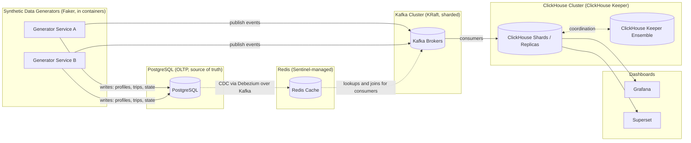
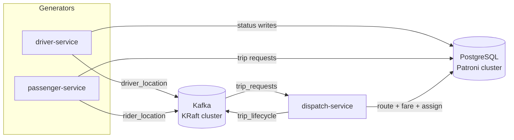
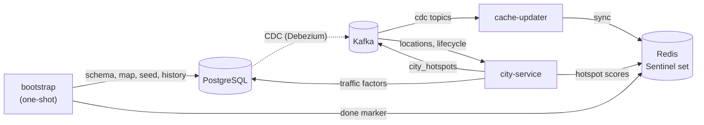
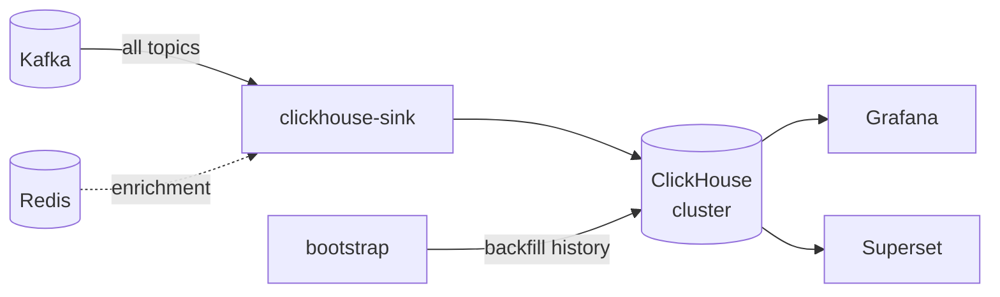
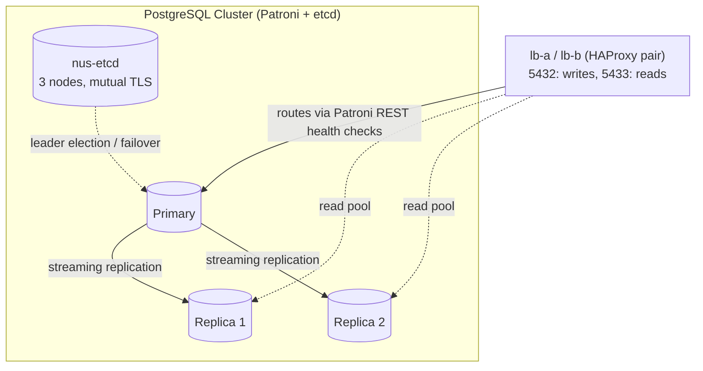
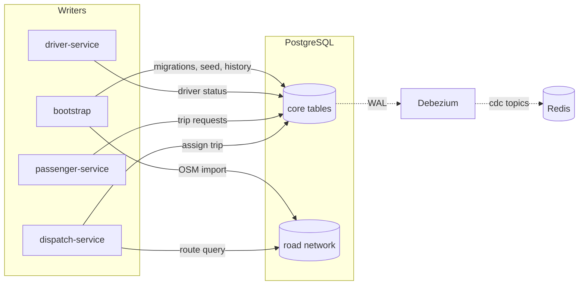
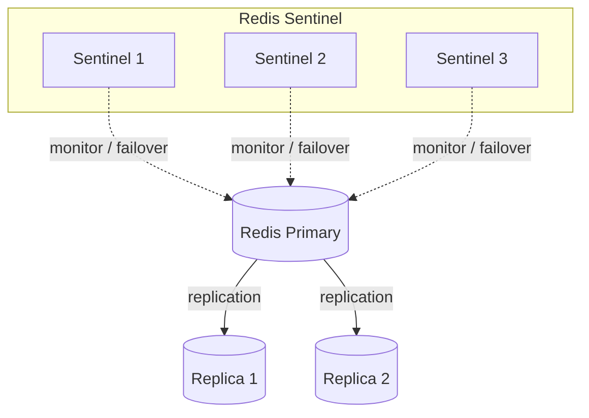
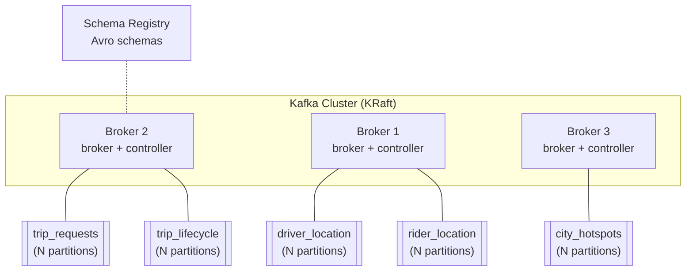
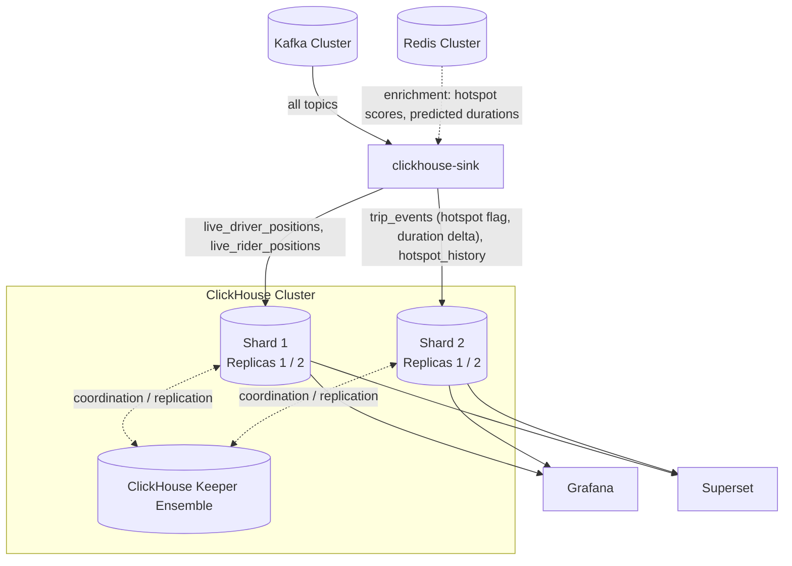

# Meanul Data Studio

## 1. About Meanul Data Studio

Meanul Data Studio is a framework for simulating the **full backend data
lifecycle of an online platform**, end to end, packaged as a set of Docker
containers and run via a single `docker-compose.yaml` on a single host.

Each "version" of the studio applies the same architectural pattern to a
different product domain — for example a cab/ride-hailing platform, a
music/video streaming platform (Spotify/Netflix-like), a flight-booking /
airport platform, and so on. The studio is designed to host **multiple such
versions over time**; the pattern itself is domain-agnostic:

- **Synthetic data generation** — All activity (users, drivers, listeners,
  trips, plays, bookings, etc.) is produced by services built with the
  [Faker](https://faker.readthedocs.io/) library, generating realistic,
  internally-consistent records rather than arbitrary random values.
  Generation pacing (volume, rate, time-of-day/weekday/seasonal weighting)
  is config-driven.
- **OLTP layer (PostgreSQL)** — The single source of truth for operational
  state (e.g. driver/passenger/trip tables): a solid, transactional
  database that generators write to. Semi-structured / JSON-like payloads
  are stored natively in PostgreSQL **`JSONB`** columns — no separate
  document database (e.g. MongoDB) is introduced for them.
- **Cache layer (Redis, Sentinel-managed)** — Sits in front of the OLTP
  layer as the **read path for everything else**. ClickHouse-feeding
  consumers and other mimic services must never query the PostgreSQL OLTP
  cluster directly for joins/lookups — they read from Redis instead. When
  data in PostgreSQL changes, the change is captured via **CDC (Debezium
  over Kafka)** and applied to the cache, keeping Redis consistent with
  the source of truth.
- **Streaming backbone (Kafka cluster, KRaft mode)** — A sharded,
  multi-broker Kafka cluster running in KRaft mode (no ZooKeeper).
  Generators and/or the OLTP layer publish **binary Avro** events onto
  Kafka topics, with schemas managed by a schema registry.
- **OLAP layer (ClickHouse, ClickHouse Keeper)** — A sharded/replicated
  ClickHouse cluster fed from Kafka, coordinated via a ClickHouse Keeper
  ensemble (no ZooKeeper dependency).
- **Dashboards** — [Grafana](https://grafana.com/) for live/operational
  views and [Apache Superset](https://superset.apache.org/) for analytical
  BI dashboards, both backed by ClickHouse.

Every component, including the Python generator services, runs inside its
own Docker container — there is no host-level virtual environment; any
Python `venv`s live entirely inside the container images.



## 2. Version 1 — Cab / Ride-Hailing Platform

Version 1 simulates an online cab/ride-hailing platform: drivers and
passengers, trip requests, real-time location streaming during a trip, real
routes over the NYC street network, dynamic demand "hotspots", and the
analytics built on top of all of the above.

### 2.1 Services

The platform is split into one **one-shot init service** and several
**long-running services**, each its own container:

| Service | Type | Responsibility |
| --- | --- | --- |
| `bootstrap` | one-shot | Runs DB migrations (plain ordered SQL), downloads the NYC OSM extract (**skipped when already present on its volume**), imports it into PostgreSQL and builds the pgRouting topology, seeds initial reference data (drivers, passengers, city zones), generates **one week of historical mock activity** (trips, locations, per-segment traffic), bulk-loads that week into ClickHouse so dashboards start populated, and finally sets the `system:bootstrap:done` marker in Redis. Exits and is removed when done. |
| `driver-service` | long-running | Simulates the pool of active drivers (not one container per driver — one service internally manages many simulated drivers). Produces driver status/location activity. |
| `passenger-service` | long-running | Simulates the pool of riders. Produces trip requests and rider device location streams. |
| `dispatch-service` | long-running | Matches trip requests from `passenger-service` to available drivers, computes the route via pgRouting, calculates the fare estimate (base + distance + time, surge-adjusted), and assigns the trip. |
| `city-service` | long-running | Watches live trip/location traffic, computes per-zone demand "hotspot" scores and per-road-segment congestion factors (refreshing `segment_traffic` used by routing), and publishes hotspots so drivers can be guided toward demand. |
| `clickhouse-sink` | long-running | Consumes Kafka topics, enriches events via Redis, and writes into the ClickHouse cluster for analytics/dashboards. |
| `cache-updater` | long-running | Consumes the Debezium CDC topics and applies PostgreSQL changes to Redis, keeping the cache in sync with the source of truth. |

Note: in the real world, driver-side and rider-side telemetry are **not**
1:1 mirrors of each other (different devices, different sampling rates,
different failure modes) — `driver-service` and `passenger-service` are
independent generators that happen to refer to the same trips, not a single
simulation duplicated into two streams.

Naming: the plain names above (`driver-service`, `cache-updater`, ...) are
the docker-compose service/container names; the alphabetic directory
prefixes in [2.8](#28-project-structure) (`j-service-driver`, ...) encode
build order only. Shared resources carry the **`nus-` prefix — the acronym
of *n*ot-*u*ber-*s*ervice**: the `nus-backbone` Docker network, the
`nus-pg` Patroni scope, the `nus-etcd` cluster, and the `nus/` image
namespace.

#### Load-balancer tier (lb-a / lb-b)

Two HAProxy containers form a single **active-passive** entry tier for the
whole stack: every client lists both (`lb-a,lb-b`) and fails over
client-side. The pair routes:

- **5432 / 5433** -> PostgreSQL primary (writes) / replicas (reads),
  driven by Patroni's REST health endpoints;
- **8123 / 9000** -> healthy ClickHouse nodes (HTTP / native protocol);
- **3000 / 8088** -> the Grafana / Superset UIs (single entry point for
  host ports).

Kafka and Redis are deliberately **not** proxied: both protocols perform
their own server discovery (advertised listeners, Sentinel) and a TCP load
balancer in the middle would break it.

#### Trip lifecycle & fares

Every trip walks a status machine, and terminal outcomes are drawn from
config-driven weights:

```
requested -> matched -> accepted -> en_route_pickup -> in_progress -> completed
```

Terminal alternatives at the appropriate stages: `cancelled_by_passenger`,
`cancelled_by_driver`, `no_driver_found` — defaults: ~70% `completed` and
~30% spread across the three, all tunable in the pacing config.

Fares implement **surge pricing**, closing the loop with the hotspot
system:

- **Estimate at assignment**:
  `fare_estimate = (base_fare + per_km * route_km + per_min * predicted_min) * surge`,
  where `surge` is derived from the pickup zone's `hotspot:{zone}:{period}`
  score at request time.
- **Final fare at completion** recomputes the time component from the
  actual duration.
- The estimate, the final fare, and the surge multiplier used are all
  stored on the trip and flow into ClickHouse for revenue/surge analytics.

#### Container startup procedure

`docker-compose up` brings the stack up in a strict order, enforced through
healthchecks and `depends_on: condition: service_healthy`:

1. **Infrastructure clusters** start first: the HAProxy pair
   (`lb-a` / `lb-b`), PostgreSQL (Patroni-managed), Redis + Sentinel,
   Kafka (KRaft) + Schema Registry + Debezium Connect, ClickHouse + Keeper,
   Grafana, Superset — each with a healthcheck.
2. **Long-running app services** (`driver-service`, `passenger-service`,
   `dispatch-service`, `city-service`, `clickhouse-sink`, `cache-updater`)
   start once the infrastructure they depend on is healthy, and wait in
   standby until the data layer is initialized.
3. **`bootstrap` is the last container to come up**, gated on every other
   service being healthy. It runs migrations, downloads the NYC OSM extract
   (skipped if already cached on its volume), builds the pgRouting
   topology, seeds reference data plus one week of historical mock activity
   (including per-segment traffic baselines), bulk-loads that week into
   ClickHouse, then — as its final act — sets the `system:bootstrap:done`
   marker key in Redis and exits successfully. During this phase the stack
   may briefly approach the server memory ceiling (see
   [2.9](#29-resource-allocation)).
4. The standby app services poll `system:bootstrap:done`; once it appears
   they begin generating live activity, and from this point the whole
   ecosystem runs purely from its configuration. The cache needs no
   explicit preload — Debezium replays the seeded rows from the WAL and
   `cache-updater`'s idempotent upserts fill Redis.

### 2.2 High-level overview (HLD)

The overview is split into three small diagrams — write path, feedback
loops, and analytics path — so each stays readable.

**Write path (live activity):**



**Feedback loops (cache sync, hotspots, init):**



(Services read profiles, active trips, hotspot scores, and the driver geo
index from Redis — never from PostgreSQL directly.)

**Analytics path:**



### 2.3 PostgreSQL cluster (HLD)

PostgreSQL is the system of truth for all transactional/operational state
and the NYC road network graph. It runs as a real cluster — **one primary +
two streaming replicas with automatic failover managed by Patroni**, backed
by **nus-etcd: a 3-node, mutually-TLS-secured etcd cluster** (certificates
auto-generated for 10 years with per-node SANs). nus-etcd doubles as the
**stack's shared key-value/DCS store** — any future component that needs
etcd reuses this cluster rather than deploying its own. The PostgreSQL
layer relies on three pillars:

- **[PostGIS](https://postgis.net/)** — the extension that stores the NYC
  map: road geometries, pickup/drop-off points, and route linestrings live
  in `geometry` columns with GiST spatial indexes.
- **[pgRouting](https://pgrouting.org/)** — the extension that turns the
  map into a routable graph and finds the best path for each trip
  (see [2.7](#27-nyc-road-network--routing) for the traffic-aware cost
  model).
- **`JSONB`** — all JSON-like / semi-structured payloads (device metadata,
  event payloads, flexible trip attributes) are stored in native `JSONB`
  columns with GIN indexes where needed — PostgreSQL covers the
  document-store role, so no MongoDB is part of the stack.

**Entry point:** services never hard-code the primary — they connect
through the stack's HAProxy pair (`lb-a` / `lb-b`, see
[2.1](#load-balancer-tier-lb-a--lb-b)), which routes by querying Patroni's
REST API: port **5432** -> current primary (read/write), port **5433** ->
replicas (read-only pool). On failover Patroni promotes a replica and the
proxies follow automatically — clients just reconnect.

**Migrations** are plain, ordered SQL files
(`h-bootstrap/migrations/001_*.sql`, `002_*.sql`, ...) applied exactly once
by `bootstrap` — no migration framework is needed for a one-shot init.





Core tables (conceptual):

- `drivers` — driver profile + current status (offline/idle/en-route/on-trip);
  device/vehicle metadata in `JSONB`.
- `passengers` — passenger/rider profile; preferences/device metadata in
  `JSONB`.
- `trips` — pickup point, drop-off point (PostGIS points), assigned driver,
  computed route geometry (PostGIS linestring), predicted duration, status
  (lifecycle in [2.1](#21-services)), fare estimate / final fare / surge
  multiplier, timestamps; flexible attributes in `JSONB`.
- `city_zones` — NYC zone/grid definitions used for hotspot aggregation.
- `segment_traffic` — per-road-segment congestion factors: baseline from the
  bootstrap-seeded historical week, continuously refreshed by `city-service`
  from live streams; consumed by pgRouting as edge-cost multipliers.
- `ways` / `ways_vertices_pgr` — pgRouting topology built from the NYC OSM
  extract (see [2.7](#27-nyc-road-network--routing)).

> **Note:** this table list is a conceptual demonstration only. The final
> schema is settled during development against the running PostgreSQL —
> additional tables may well be added along the way.

### 2.4 Redis cluster (HLD)

Redis runs as a Sentinel-managed primary/replica set and is the **only**
read path for cached reference and hot-path data — generators, dispatch,
the city service, and the ClickHouse sink read from here, never directly
from PostgreSQL.



Key spaces (conceptual):

| Key pattern | Written by | Read by | Notes |
| --- | --- | --- | --- |
| `driver:{id}` | `cache-updater` (CDC) | `driver-service`, `dispatch-service`, `clickhouse-sink` | profile + current status |
| `passenger:{id}` | `cache-updater` (CDC) | `passenger-service`, `dispatch-service`, `clickhouse-sink` | profile |
| `trip:{id}:active` | `dispatch-service` | `driver-service`, `passenger-service`, `clickhouse-sink` | active-trip state incl. route + predicted duration |
| `geo:drivers:available` | `driver-service` | `dispatch-service` | Redis GEO set for nearest-driver lookup |
| `hotspot:{zone}:{period}` | `city-service` | `driver-service`, `dispatch-service` (surge), `clickhouse-sink` | demand score, **TTL = 6h** (24h split into 4 periods) |
| `system:bootstrap:done` | `bootstrap` (final act) | all app services (startup poll) | readiness marker, no TTL |

`cache-updater` upserts are **idempotent (last-write-wins per key)** — the
cache is filled by Debezium's CDC replay of the bootstrap-seeded rows
rather than an explicit preload, so replays and service restarts are
harmless by construction.

> **Note:** the key spaces above are a conceptual demonstration only. The
> final key layout is settled during development against the running
> Redis — additional key spaces may well be added.

### 2.5 Kafka cluster (HLD)

Kafka runs as a sharded, multi-broker cluster in **KRaft mode** (combined
broker/controller nodes, no ZooKeeper). All events are encoded as **binary
Avro**: a **Schema Registry** container holds every topic's schema,
producers register/resolve schemas at startup, and consumers fetch them by
the schema id embedded in each message. Debezium Connect uses its Avro
converter, so the `cdc.*` topics share the same encoding. Topics are
created with **replication factor 3** and `min.insync.replicas = 2`
across the three brokers.

Binary does **not** mean unreadable — every topic stays inspectable and
queryable (the concrete recipes live in `c-infra-kafka/`'s docs):

- **Live tail, decoded to JSON**:
  `kcat -s avro -r http://schema-registry:8081` or
  `kafka-avro-console-consumer` decode messages on the fly through the
  Schema Registry.
- **SQL directly over a live topic**: ClickHouse's Kafka table engine
  reads topics with `format = 'AvroConfluent'` +
  `format_avro_schema_registry_url`, so ad-hoc `SELECT`s can be run
  against the stream itself — no extra component needed.
- **SQL over the full history**: `clickhouse-sink` lands every event in
  ClickHouse anyway, so anything that ever passed through Kafka is one
  query away in `clickhouse-client`, Grafana, or Superset.



| Topic | Partitions | Producer | Consumer(s) |
| --- | --- | --- | --- |
| `driver_location` | 6 | `driver-service` | `city-service`, `clickhouse-sink` |
| `rider_location` | 6 | `passenger-service` | `city-service`, `clickhouse-sink` |
| `trip_requests` | 3 | `passenger-service` | `dispatch-service`, `clickhouse-sink` |
| `trip_lifecycle` | 3 | `dispatch-service` | `city-service`, `clickhouse-sink` |
| `city_hotspots` | 3 | `city-service` | `clickhouse-sink` |
| `cdc.*` (per table) | 3 | Debezium Connect (from PostgreSQL WAL) | `cache-updater` |

The high-volume location topics get 6 partitions (keyed by driver/rider id
so per-entity ordering is preserved); everything else gets 3, one per
broker.

> **Note:** the topic map above is a conceptual demonstration only. The
> final topic/partition layout is settled during development against the
> running Kafka cluster — topics may be added or resized.

### 2.6 ClickHouse cluster (HLD)

ClickHouse runs as **2 shards x 2 replicas** coordinated by a **3-node
ClickHouse Keeper ensemble** (no ZooKeeper) — sharding and replication are
both demonstrated at a footprint that fits a single host. `clickhouse-sink`
consumes every Kafka topic above and writes into denormalized analytics
tables that back Grafana (live/ops) and Superset (BI).

**Relationship with the Redis cluster:** before inserting, the sink
enriches events using Redis-cached state — for example, when a completed
trip arrives it looks up `hotspot:{zone}:{period}` to mark whether it was a
**hotspot trip**, and compares the actual duration against the predicted
duration cached on `trip:{id}:active` to flag trips that **took longer than
predicted** so Grafana can surface them. This keeps all such lookups off
the PostgreSQL OLTP cluster, per the cache-first rule in Section 1.

**Client entry point:** clients (`clickhouse-sink`, Grafana, Superset)
reach the cluster through the stack's HAProxy pair (`lb-a` / `lb-b`),
which balances ports 8123 (HTTP) and 9000 (native) across healthy nodes;
`Distributed` tables then route queries inside the cluster. `bootstrap`
bulk-loads the historical week here so dashboards are populated from the
first minute. Grafana connects through the official ClickHouse datasource
plugin; Superset connects via `clickhouse-connect` and keeps its own
application metadata in **SQLite on a named volume** (sufficient for the
single-user setup — the OLTP cluster stays untouched).

> **Note:** the analytics tables shown are a conceptual demonstration
> only. The final ClickHouse schema is settled during development against
> the running cluster — more tables and materialized views may be added.



### 2.7 NYC road network & routing

The PostgreSQL OLTP database holds the NYC street network as a routable
graph, used to compute a real route (pickup -> drop-off) for every trip.
The map is stored by the **PostGIS** extension and routed by the
**pgRouting** extension:

- **Source data**: an OpenStreetMap extract for New York City (e.g. via
  Geofabrik or the OSM Overpass API), which provides accurate, freely
  licensed street geometry and metadata for the full road network.
- **Loading**: the `bootstrap` service downloads the extract onto a named
  volume — **the download is skipped entirely when the file is already
  present and checksum-valid**, so repeated `docker-compose up` runs never
  re-fetch it — then imports it into PostgreSQL/**PostGIS** and converts it
  into a routable topology using `osm2pgrouting` (or `osm2pgsql` +
  pgRouting's topology functions), producing the standard pgRouting
  `ways` / `ways_vertices_pgr` tables.
- **Traffic-aware best path**: routing does not use raw geometric distance
  alone. Each road segment's cost is its base travel time (length /
  segment speed) multiplied by a **congestion factor** from the
  `segment_traffic` table. The baseline factors come from the week of
  historical activity seeded by `bootstrap`; from then on `city-service`
  continuously recomputes them from the live `driver_location` /
  `rider_location` streams. The same trip can therefore get a different
  "best" route at rush hour than at 3 AM.
- **Routing**: for each trip, `dispatch-service` calls pgRouting
  (`pgr_dijkstra` or `pgr_astar`) with the traffic-weighted edge costs to
  compute the best path between the pickup and drop-off vertices; the
  resulting route geometry (PostGIS linestring) and predicted duration are
  stored on the trip record. The predicted duration is what the
  `clickhouse-sink` later compares against actual duration to flag
  overrunning trips.
- **Indexing**: spatial indexes (GiST on geometry columns) and pgRouting's
  vertex/edge indexes are applied so route lookups remain fast as trip
  volume grows.
- **Simulation clock & timezones**: the bootstrap-seeded week carries real
  past timestamps (now − 7 days ... now); live services run on the wall
  clock. The timezone policy is explicit and stack-wide: **every container
  runs with `TZ=UTC`** (set via each `.env`), PostgreSQL pins `timezone`
  and `log_timezone` to UTC, and all stored timestamps are UTC. The single
  deliberate exception is the pacing config, interpreted in NYC local time
  (`SIM_TIMEZONE=America/New_York`) — rush hour means NYC rush hour.

### 2.8 Project structure

Each version of the studio lives in its own top-level directory; Version 1
is `not-uber-service/` (fun naming intended). Future versions will sit next
to it as siblings.

**Modular compose:** every component directory ships its own
`docker-compose.yaml` defining just its containers, volumes, and networks;
the root `not-uber-service/docker-compose.yaml` stitches the full stack
together with Compose's `include:` directive. Each component can therefore
be brought up and tested **in isolation** (`docker compose up` inside its
directory) — exactly matching the build/test order below — while the root
file still provides the single-command full-stack deployment.

Every component lives directly under `not-uber-service/` (no `infra/` /
`services/` / `docs/` grouping) and is named
`<letter>-infra-<name>` or `<letter>-service-<name>`, where the letter
encodes a single **alphabetic build/test-order** (`a-`, `b-`, `c-`, ...)
across the whole stack — sorting the directory alphabetically shows
exactly the order each piece should be written and tested in. **All
infrastructure clusters (`infra-*`) come first, as a block, since they are
the foundation every service is built on; `bootstrap` and the app services
(`service-*`) follow.** Each component's own design notes live inside its
own directory rather than in a shared `docs/`. See
[2.8.1](#281-build--test-order) for the dependency reasoning behind the
sequence.

```
meanul-data-studio/
├── README.md
├── LICENSE
├── .gitignore
└── not-uber-service/                 # Version 1 — cab / ride-hailing platform
    ├── README.md                     # step-by-step runbook for bringing the stack up
    ├── docker-compose.yaml           # root file: lb-a/lb-b + include of every component compose
    ├── .env.example                  # template for the untracked .env (stack-wide settings)
    ├── sketch/                       # superseded first-draft generator (reference only)
    ├── a-infra-postgres/             # Patroni (primary + 2 replicas) + etcd config
    │   └── docker-compose.yaml       # component compose (every component dir has one)
    ├── b-infra-redis/                # nus-cache: 3 data nodes + 3 Sentinels, config templates
    ├── c-infra-kafka/                # KRaft brokers, Schema Registry, topic list, Avro schemas
    ├── d-infra-debezium/             # Kafka Connect + Avro converter, PostgreSQL CDC connector
    ├── e-infra-clickhouse/           # 2x2 cluster + Keeper config, table DDL, clickhouse-cluster-design.md
    ├── f-infra-grafana/              # provisioned ClickHouse datasource + live dashboard
    ├── g-infra-superset/             # Superset + ClickHouse driver, init one-shot
    ├── h-bootstrap/                  # one-shot init service (starts last, then removed)
    │   ├── migrations/               # SQL schema migrations
    │   ├── osm/                      # NYC OSM extract download + osm2pgrouting setup
    │   └── seed/                     # initial drivers/passengers/city_zones data
    ├── i-service-cache-updater/      # CDC topics -> Redis
    ├── j-service-driver/
    ├── k-service-passenger/
    ├── l-service-dispatch/
    ├── m-service-city/
    ├── n-service-clickhouse-sink/
    ├── z-config/                     # stack-level config (sorts last on purpose)
    │   └── haproxy/                  # lb-a / lb-b config
    └── z-lib/                        # shared Python code (sorts last for the same reason)
        └── nus-common/               # clients, logging, lifecycle used by h- and every service
```

**Toolchain:** every Python component (`h-bootstrap` and the six
`*-service-*` directories) targets **Python 3.13** (the latest
long-support release) with **[uv](https://docs.astral.sh/uv/)** as the
dependency manager — each component carries its own `pyproject.toml` +
`uv.lock` and a multi-stage Dockerfile (`uv sync` in the build stage, slim
runtime stage; no venv ever touches the host). What all seven have in
common — reading settings, JSON logging, clean shutdown, and the clients for
PostgreSQL, Redis, Kafka and ClickHouse — lives once in `z-lib/nus-common`
and is pulled in as a path dependency; their build context is
`not-uber-service/` so the image holds the same layout as the repository.
The HAProxy pair is stack-wide, so its two services are defined in the root
`docker-compose.yaml` with their config under `z-config/haproxy/`
(`z-config/` sorts last and collects stack-level config files; the
ClickHouse and UI routes are enabled there as those components land). The
Schema Registry config lives in `c-infra-kafka/`.

#### 2.8.1 Build & test order

Infrastructure is provisioned first as a block (`a-` to `g-`), since every
service depends on some part of it; `bootstrap` and the app services
(`h-` to `n-`) follow in dependency order, so each piece can be written and
tested in isolation before the next depends on it:

| Step | Component | Why this point in the sequence |
| --- | --- | --- |
| `a-` | `a-infra-postgres` | Foundation: schema, PostGIS/pgRouting extensions, Patroni cluster — testable standalone with raw SQL. |
| `b-` | `b-infra-redis` | Sentinel cache cluster — testable standalone (set/get, failover). |
| `c-` | `c-infra-kafka` | Streaming backbone — testable standalone (produce/consume) before any producer/consumer exists. |
| `d-` | `d-infra-debezium` | Needs `a` + `c`: CDC connector turning Postgres WAL into Kafka `cdc.*` topics. |
| `e-` | `e-infra-clickhouse` | OLAP cluster — testable standalone (DDL, inserts, replication); includes the cluster topology design notes. |
| `f-` | `f-infra-grafana` | Datasource/provisioning against `e`; dashboards populate once services produce data. |
| `g-` | `g-infra-superset` | Datasource/provisioning against `e`; dashboards populate once services produce data. |
| `h-` | `h-bootstrap` | Needs `a` + `b` running: migrations, OSM import/topology build, seed data, historical week, cache preload. |
| `i-` | `i-service-cache-updater` | Needs `b` + `d`: consumes `cdc.*`, proves the cache-sync loop end-to-end. |
| `j-` | `j-service-driver` | Needs `a`, `b`, `c`, `i`: first activity generator — profiles, status, location stream. |
| `k-` | `k-service-passenger` | Same dependencies as `j`; built second since dispatch needs both. |
| `l-` | `l-service-dispatch` | Needs `j` + `k`: matching, pgRouting route calc, trip assignment. |
| `m-` | `m-service-city` | Needs `c` + `b` (and benefits from `n` for validation): hotspot scoring, traffic factors. |
| `n-` | `n-service-clickhouse-sink` | Needs `c`, `b`, `e`: Kafka -> Redis-enriched -> ClickHouse — last, since it depends on data from `j`-`m`. |

### 2.9 Resource allocation

The stack targets a dedicated Docker server with **20 CPU cores, 120 GB
RAM, and NVMe storage**. The complete topology has many stateful
containers, JVM services, and OLAP nodes, so the project is documented and
sized for that server class only.

Resource limits are declared directly in each component's Compose file.
Explicit limits are mandatory: the JVM-based components (Kafka, Debezium
Connect) and ClickHouse will otherwise size themselves against all visible
host RAM.

The stack is brought up with the root compose file:

```bash
docker compose up -d
```

The root file defines stack-level services such as `lb-a`/`lb-b` and
includes each component compose file as that component lands. Each service
sets `cpus`, `mem_limit`, and `memswap_limit`, with `memswap_limit` equal
to `mem_limit` so no container can swap.

Two assumptions keep the budget realistic: generation pacing is configured
for **moderate volumes** (this is a simulation, not Uber-scale traffic),
and Grafana/Superset serve a **single dashboard user**.

Storage is not expected to be the first constraint: at the default
moderate pacing, ClickHouse produces low single-digit GB per day and Kafka
retention is bounded.

| Component | Containers | CPU each | Mem each | Mem subtotal |
| --- | --- | --- | --- | --- |
| PostgreSQL nodes (Patroni — identical limits, leader elected) | 3 | 1.6 | 9 GB | 27 GB |
| HAProxy pair (`lb-a` / `lb-b`) | 2 | 0.1 | 128 MB | 0.25 GB |
| nus-etcd cluster (shared DCS/KV, TLS) | 3 | 0.15 | 384 MB | 1.13 GB |
| Redis nodes (Sentinel — identical limits, primary elected) | 3 | 0.5 | 4 GB | 12 GB |
| Redis Sentinel | 3 | 0.1 | 192 MB | 0.56 GB |
| Kafka brokers | 3 | 1.2 | 5.5 GB (3.5 GB heap) | 16.5 GB |
| Schema Registry | 1 | 0.2 | 1 GB | 1 GB |
| Debezium Connect | 1 | 0.4 | 2 GB | 2 GB |
| ClickHouse nodes (2x2) | 4 | 1.3 | 8 GB | 32 GB |
| ClickHouse Keeper | 3 | 0.1 | 1 GB | 3 GB |
| Grafana | 1 | 0.2 | 1 GB | 1 GB |
| Superset (single user, single worker, SQLite metadata) | 1 | 0.6 | 3 GB | 3 GB |
| App services (driver, passenger, dispatch, city, sink, cache-updater) | 6 | 0.15 | 768 MB | 4.5 GB |
| **Steady-state total** | **34** | **~18.65 (of 20, no overcommit)** | | **~104 GB** |
| `bootstrap` (transient, exits after init) | 1 | 1.25 | 8 GB | peak ~112 GB |

The steady-state budget leaves roughly **16 GB** for the host OS and
operational headroom on a 120 GB server. The transient `bootstrap` gets
**8 GB** because the OSM import is memory-hungry on the NYC extract; even at
that peak (~112 GB) the host keeps ~8 GB free, and bootstrap's 1.25 CPU fits
inside the 20-core ceiling (19.9 of 20) because the app services are still in
standby while it runs.

**CPU, not RAM, is what bounds the topology.** With no overcommit the 20
cores are the scarce resource: ClickHouse at 2 shards x 2 replicas already
takes 5.2 of them, so doubling the shard count would blow the CPU budget long
before the memory one. The headroom on a 120 GB host is therefore spent
deepening the existing nodes — PostgreSQL 9 GB, Kafka 5.5 GB, ClickHouse
8 GB — rather than adding more of them.

Key tuning that makes the budget fit: `KAFKA_HEAP_OPTS` capped per
broker, ClickHouse `max_server_memory_usage` set below its container
limit, PostgreSQL `shared_buffers`/`work_mem` sized to its limit, and
Superset running in single-worker mode with SQLite metadata.

#### No-swap policy

Every service sets `memswap_limit` equal to its memory limit. Under Linux
semantics memory+swap = memory, i.e. **zero swap per container**.

The consequence is deliberate: an undersized container gets **OOM-killed
and restarted** (visible in `docker ps`/restart counts) instead of
silently swapping and dragging the whole stack down.

#### Validating that the budget is enough

The limits are hard ceilings, so "does it fit?" is observable rather than
hoped for:

- **Live usage**: `docker stats` shows per-container memory against its
  limit; anything pinned at its cap is a candidate for rebalancing.
- **OOM signals**: `docker inspect --format '{{.RestartCount}} {{.State.OOMKilled}}'`
  per container — any OOM kill means that component's limit or the pacing
  config must come down.
- **Pipeline health**: Kafka consumer-group lag (must stay bounded),
  ClickHouse ingestion delay, and Patroni/Sentinel/Keeper health checks.
- **Soak test**: after `bootstrap` completes, run the stack at target
  pacing for several hours and confirm all of the above stay flat. The
  pacing config is the relief valve — volumes are turned down in config,
  never by removing containers.

#### Capacity estimate at default pacing

The bottleneck is **not** Kafka or ClickHouse (at these limits they
comfortably handle thousands of messages/s and tens of thousands of
batched row inserts/s respectively). The realistic constraints are the
Python generators and, above all, **per-trip pgRouting computation** on
the NYC graph (~50–150 ms per `pgr_dijkstra`/`pgr_astar` call):

| Metric | Sustained estimate |
| --- | --- |
| Concurrent simulated drivers | ~500–1,000 |
| New trips (routed via pgRouting) | ~5–10 trips/s (~0.4–0.9 M trips/day) |
| Location events (driver + rider, every 2–5 s per device) | ~400–800 events/s (~35–70 M events/day) |
| ClickHouse ingestion (compressed, ~200 B/event) | ~1–2 GB/day |
| Kafka disk (48 h retention) | a few GB, bounded |

At ~1–2 GB/day in ClickHouse, the 1 TB disk holds **months to years** of
simulated history; ClickHouse table TTLs and Kafka retention keep growth
bounded regardless. These figures are design estimates to be confirmed by
the soak test above, and they are an order of magnitude below what the
infrastructure layers can absorb — headroom, not a cliff.

### 2.10 Showcase

_Screenshots of the running system (PostgreSQL data, Grafana dashboards,
Superset dashboards, etc.) will be added here._
