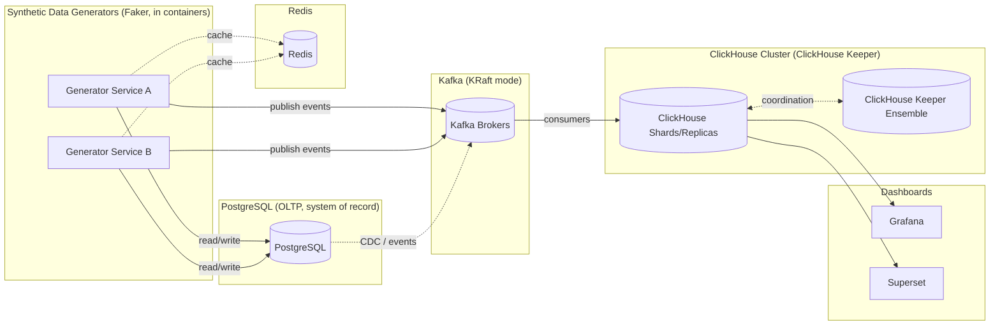
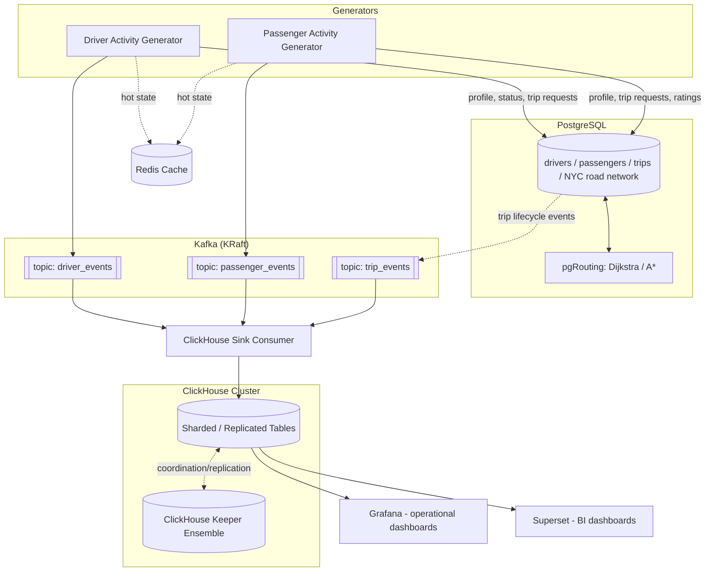

# Meanul Data Studio

## 1. About Meanul Data Studio

Meanul Data Studio is a framework for simulating the **full backend data
lifecycle of an online platform**, end to end, packaged as a set of Docker
containers and run via a single `docker-compose.yml` on a single host.

Each "version" of the studio applies the same architectural pattern to a
different product domain (e.g. a cab/ride-hailing platform, a music/video
streaming platform). The pattern itself is domain-agnostic:

- **Synthetic data generation** — All activity (users, drivers, listeners,
  trips, plays, etc.) is produced by services built with the
  [Faker](https://faker.readthedocs.io/) library, generating realistic,
  internally-consistent records rather than arbitrary random values.
  Generation pacing (volume, rate, time-of-day/weekday/seasonal weighting)
  is config-driven.
- **OLTP layer (PostgreSQL)** — The system of record for operational state
  produced by the generators.
- **Cache layer (Redis)** — Hot-path caching alongside the OLTP layer.
- **Streaming backbone (Kafka, KRaft mode)** — Generators and/or the OLTP
  layer publish events onto Kafka topics. Kafka runs in KRaft mode (no
  ZooKeeper).
- **OLAP layer (ClickHouse, ClickHouse Keeper)** — A sharded/replicated
  ClickHouse cluster fed from Kafka, coordinated via a ClickHouse Keeper
  ensemble (no ZooKeeper dependency).
- **Dashboards** — [Grafana](https://grafana.com/) for live/operational
  views and [Apache Superset](https://superset.apache.org/) for analytical
  BI dashboards, both backed by ClickHouse.

Every component, including the Python generator services, runs inside its
own Docker container — there is no host-level virtual environment; any
Python `venv`s live entirely inside the container images.

## 2. Version 1 — Cab / Ride-Hailing Platform

Version 1 simulates an online cab/ride-hailing platform: drivers and
passengers, trip requests, real routes over the NYC street network, and the
analytics built on top of the resulting activity.

Components:

- **Driver activity generator** and **passenger activity generator** — two
  independent Faker-based services that create realistic profiles and
  drive trip requests/status updates over time, with configurable pacing
  (volume, rate, time-of-day/weekday/seasonal weighting) following the same
  weighted-sampling style used in the original config-driven sketch.
- **PostgreSQL** — stores drivers, passengers, trips, computed routes, and
  the NYC road network graph used for routing.
- **pgRouting** — computes real pickup-to-dropoff routes over the NYC road
  network using Dijkstra/A*.
- **Redis** — caching layer for hot operational data (e.g. driver
  availability, active trip state).
- **Kafka (KRaft mode)** — streams driver, passenger, and trip lifecycle
  events from the generators/OLTP layer.
- **ClickHouse cluster (ClickHouse Keeper)** — sharded/replicated analytical
  store, populated via Kafka consumers, with denormalized tables optimized
  for dashboards.
- **Grafana** — live/operational dashboards on top of ClickHouse.
- **Apache Superset** — analytical BI dashboards and reports on top of
  ClickHouse.

## 3. Version 2 (planned) — Spotify/Netflix-like Streaming Platform

A future version applies the same architectural pattern from Section 1 to a
media-streaming domain (e.g. listeners/viewers, content catalog, playback
and engagement events):

- **Listener/viewer activity generator** and **content catalog generator** —
  Faker-based services producing realistic user profiles, catalog entries,
  and playback/engagement activity with the same configurable pacing model.
- **PostgreSQL** — system of record for users, content catalog, and
  subscription/account state.
- **Redis** — caching for hot-path data (e.g. session state, recommendations
  cache).
- **Kafka (KRaft mode)** — streams playback, engagement, and account events.
- **ClickHouse cluster (ClickHouse Keeper)** — analytics store for listening
  history, recommendations performance, and engagement metrics.
- **Grafana** and **Apache Superset** — operational and BI dashboards on top
  of ClickHouse.

This version is planned and not yet implemented; its detailed design will
follow the same structure as Section 2 once Version 1 is complete.
