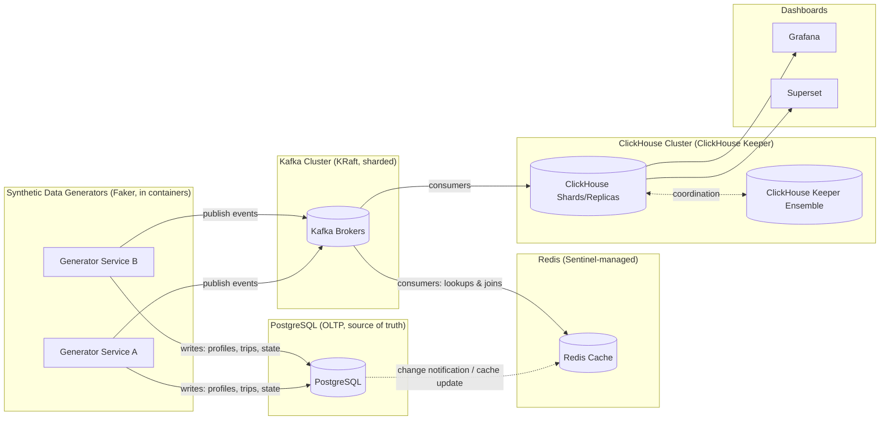
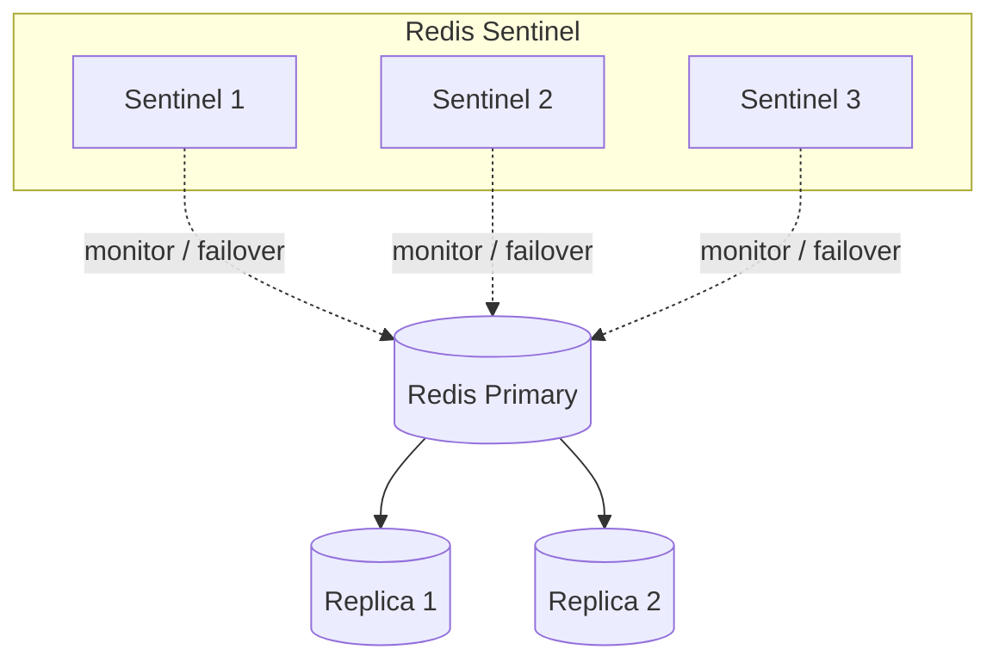
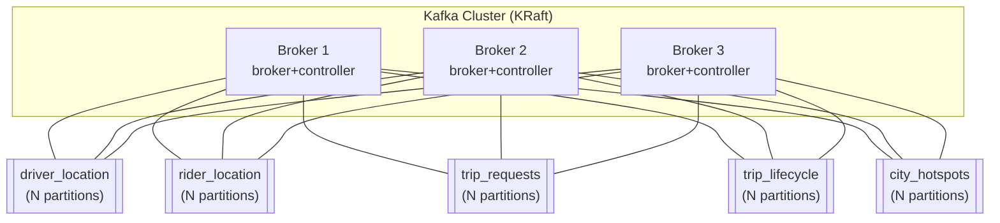
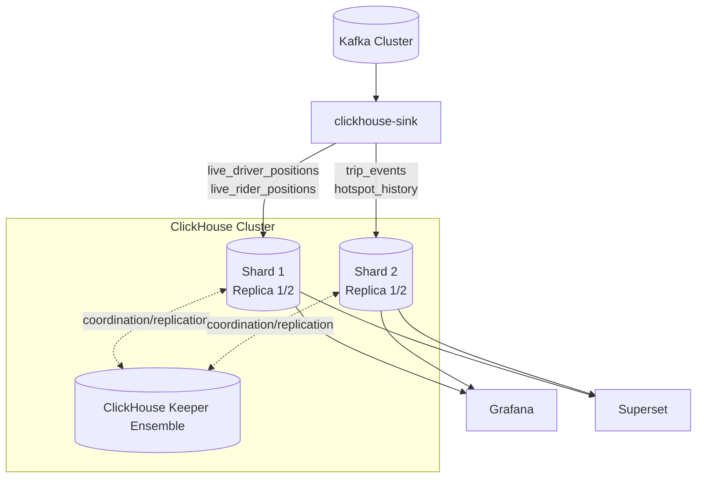

# Meanul Data Studio

## 1. About Meanul Data Studio

Meanul Data Studio is a framework for simulating the **full backend data
lifecycle of an online platform**, end to end, packaged as a set of Docker
containers and run via a single `docker-compose.yml` on a single host.

Each "version" of the studio applies the same architectural pattern to a
different product domain — for example a cab/ride-hailing platform, a
music/video streaming platform (Spotify/Netflix-like), a flight-booking /
airport platform, and so on. The studio is designed to host **multiple such
versions over time**; the pattern itself is domain-agnostic:

- **Synthetic data generation** — All activity (users, drivers, listeners,
  trips, plays, bookings, etc.) is produced by services built with the
  [Faker](https://faker.readthedocs.io/) library, generating realistic,
  internally-consistent records rather than arbitrary random values.
  Generation pacing (volume, rate, time-of-day/weekday/seasonal weighting)
  is config-driven.
- **OLTP layer (PostgreSQL)** — The single source of truth for operational
  state (e.g. driver/passenger/trip tables): a solid, transactional
  database that generators write to.
- **Cache layer (Redis, Sentinel-managed)** — Sits in front of the OLTP
  layer as the **read path for everything else**. ClickHouse-feeding
  consumers and other mimic services must never query the PostgreSQL OLTP
  cluster directly for joins/lookups — they read from Redis instead. When
  data in PostgreSQL changes, PostgreSQL informs the cache so it can be
  updated/invalidated, keeping Redis consistent with the source of truth.
- **Streaming backbone (Kafka cluster, KRaft mode)** — A sharded,
  multi-broker Kafka cluster running in KRaft mode (no ZooKeeper).
  Generators and/or the OLTP layer publish events onto Kafka topics.
- **OLAP layer (ClickHouse, ClickHouse Keeper)** — A sharded/replicated
  ClickHouse cluster fed from Kafka, coordinated via a ClickHouse Keeper
  ensemble (no ZooKeeper dependency).
- **Dashboards** — [Grafana](https://grafana.com/) for live/operational
  views and [Apache Superset](https://superset.apache.org/) for analytical
  BI dashboards, both backed by ClickHouse.

Every component, including the Python generator services, runs inside its
own Docker container — there is no host-level virtual environment; any
Python `venv`s live entirely inside the container images.



## 2. Version 1 — Cab / Ride-Hailing Platform

Version 1 simulates an online cab/ride-hailing platform: drivers and
passengers, trip requests, real-time location streaming during a trip, real
routes over the NYC street network, dynamic demand "hotspots", and the
analytics built on top of all of the above.

### 2.1 Services

The platform is split into one **one-shot init service** and several
**long-running services**, each its own container:

| Service | Type | Responsibility |
| --- | --- | --- |
| `bootstrap` | one-shot, runs once | Runs DB migrations, imports the NYC OSM road network into PostgreSQL and builds the pgRouting topology, and seeds initial reference data (drivers, passengers, city zones). Exits and is removed once `docker-compose up` has finished bringing the stack up. |
| `driver-service` | long-running | Simulates the pool of active drivers (not 1:1 containers — one service internally manages many simulated drivers). Produces driver status/location activity. |
| `passenger-service` | long-running | Simulates the pool of riders. Produces trip requests and rider device location streams. |
| `dispatch-service` | long-running | Matches trip requests from `passenger-service` to available drivers, computes the route via pgRouting, and assigns the trip. |
| `city-service` | long-running | Watches live trip/location traffic, computes per-zone demand "hotspot" scores, and publishes them so drivers can be guided toward demand. |
| `clickhouse-sink` | long-running | Consumes Kafka topics and writes into the ClickHouse cluster for analytics/dashboards. |

Note: in the real world, driver-side and rider-side telemetry are **not**
1:1 mirrors of each other (different devices, different sampling rates,
different failure modes) — `driver-service` and `passenger-service` are
independent generators that happen to refer to the same trips, not a single
simulation duplicated into two streams.

### 2.2 High-level overview (HLD)

```mermaid
graph TB
    subgraph Init ["One-shot init (removed after startup)"]
        BOOT[bootstrap]
    end

    subgraph Generators ["Activity generators"]
        DRV[driver-service]
        PSG[passenger-service]
    end

    DISP[dispatch-service]
    CITY[city-service]
    SINK[clickhouse-sink]

    PG[(PostgreSQL\ndrivers / passengers / trips / NYC road network)]
    REDIS[(Redis Sentinel\nprofiles, active trips, hotspots, geo index)]
    KAFKA[(Kafka Cluster - KRaft, sharded)]
    CH[(ClickHouse Cluster)]
    GRAF[Grafana]
    SUPER[Superset]

    BOOT -->|migrations, OSM import + pgRouting topology, seed data| PG
    BOOT -->|preload cache| REDIS

    DRV -->|status/location writes| PG
    PSG -->|trip request writes| PG
    PG -.->|cache sync on change| REDIS

    DRV -->|read profile, active trip, hotspots| REDIS
    PSG -->|read profile, active trip| REDIS

    DRV -->|stream: driver_location| KAFKA
    PSG -->|stream: rider_location, trip_requests| KAFKA

    KAFKA -->|trip_requests| DISP
    DISP -->|geo lookup: nearby available drivers| REDIS
    DISP -->|pgr_dijkstra route calc + assign trip| PG
    DISP -.->|update active-trip cache| REDIS
    DISP -->|publish: trip_lifecycle| KAFKA

    KAFKA -->|driver_location, rider_location, trip_lifecycle| CITY
    CITY -->|hotspot:{zone}:{period}, TTL 6h| REDIS
    CITY -->|publish: city_hotspots| KAFKA

    KAFKA --> SINK
    SINK --> CH
    CH --> GRAF
    CH --> SUPER
```

### 2.3 PostgreSQL cluster (HLD)

PostgreSQL (with PostGIS + pgRouting extensions) is the system of truth for
all transactional/operational state and the NYC road network graph.

```mermaid
graph TB
    BOOT[bootstrap] -->|1\. run migrations| SCHEMA[(schema: drivers, passengers,\ntrips, city_zones)]
    BOOT -->|2\. import OSM extract,\nbuild pgRouting topology| ROADS[(ways / ways_vertices_pgr\nNYC road network)]
    BOOT -->|3\. seed initial rows| SCHEMA

    DRV[driver-service] -->|insert/update driver status| SCHEMA
    PSG[passenger-service] -->|insert trip request\n(status=requested)| SCHEMA
    DISP[dispatch-service] -->|pgr_dijkstra / pgr_astar\npickup -> drop-off| ROADS
    DISP -->|update trip:\nassign driver, route, status| SCHEMA

    SCHEMA -.->|logical replication / triggers\ncache sync| REDIS[(Redis)]
```

Core tables (conceptual):

- `drivers` — driver profile + current status (offline/idle/en-route/on-trip).
- `passengers` — passenger/rider profile.
- `trips` — pickup point, drop-off point, assigned driver, computed route
  geometry, status, timestamps.
- `city_zones` — NYC zone/grid definitions used for hotspot aggregation.
- `ways` / `ways_vertices_pgr` — pgRouting topology built from the NYC OSM
  extract (see [2.7](#27-nyc-road-network--routing)).

### 2.4 Redis cluster (HLD)

Redis runs as a Sentinel-managed primary/replica set and is the **only**
read path for cached reference and hot-path data — generators, dispatch,
and the city service read from here, never directly from PostgreSQL.



Key spaces (conceptual):

| Key pattern | Written by | Read by | Notes |
| --- | --- | --- | --- |
| `driver:{id}` | PostgreSQL sync (on change) | `driver-service`, `dispatch-service` | profile + current status |
| `passenger:{id}` | PostgreSQL sync (on change) | `passenger-service`, `dispatch-service` | profile |
| `trip:{id}:active` | `dispatch-service` | `driver-service`, `passenger-service` | active-trip state |
| `geo:drivers:available` | `driver-service` | `dispatch-service` | Redis GEO set for nearest-driver lookup |
| `hotspot:{zone}:{period}` | `city-service` | `driver-service` | demand score, **TTL = 6h** (24h split into 4 periods) |

### 2.5 Kafka cluster (HLD)

Kafka runs as a sharded, multi-broker cluster in **KRaft mode** (combined
broker/controller nodes, no ZooKeeper).



| Topic | Producer | Consumer(s) |
| --- | --- | --- |
| `driver_location` | `driver-service` | `city-service`, `clickhouse-sink` |
| `rider_location` | `passenger-service` | `city-service`, `clickhouse-sink` |
| `trip_requests` | `passenger-service` | `dispatch-service`, `clickhouse-sink` |
| `trip_lifecycle` | `dispatch-service` | `city-service`, `clickhouse-sink` |
| `city_hotspots` | `city-service` | `clickhouse-sink` |

### 2.6 ClickHouse cluster (HLD)

ClickHouse is sharded/replicated and coordinated by a ClickHouse Keeper
ensemble (no ZooKeeper). `clickhouse-sink` consumes every Kafka topic above
and writes into denormalized analytics tables that back Grafana (live/ops)
and Superset (BI).



### 2.7 NYC road network & routing

The PostgreSQL OLTP database holds the NYC street network as a routable
graph, used to compute a real route (pickup -> drop-off) for every trip:

- **Source data**: an OpenStreetMap extract for New York City (e.g. via
  Geofabrik or the OSM Overpass API), which provides accurate, freely
  licensed street geometry and metadata for the full road network.
- **Loading**: the `bootstrap` service imports the OSM extract into
  PostgreSQL/PostGIS and converts it into a routable topology using
  `osm2pgrouting` (or `osm2pgsql` + pgRouting's topology functions),
  producing the standard pgRouting `ways` / `ways_vertices_pgr` tables.
- **Routing**: for each trip, `dispatch-service` calls pgRouting (Dijkstra
  or A*) to compute the shortest/fastest path between the pickup and
  drop-off vertices; the resulting route geometry is stored on the trip
  record.
- **Indexing**: spatial indexes (GiST on geometry columns) and pgRouting's
  vertex/edge indexes are applied so route lookups remain fast as trip
  volume grows.

### 2.8 Project structure (placeholder)

```
meanul-data-studio/
├── docker-compose.yml
├── README.md
├── .gitignore
├── bootstrap/
│   ├── Dockerfile
│   ├── migrations/        # SQL schema migrations
│   ├── osm/                # NYC OSM extract + osm2pgrouting setup
│   └── seed/                # initial drivers/passengers/city_zones data
├── services/
│   ├── driver-service/
│   ├── passenger-service/
│   ├── dispatch-service/
│   ├── city-service/
│   └── clickhouse-sink/
├── infra/
│   ├── postgres/
│   ├── redis/             # Sentinel config
│   ├── kafka/              # KRaft broker config, topic definitions
│   ├── clickhouse/         # cluster + Keeper config, table DDL
│   ├── grafana/            # provisioned dashboards/datasources
│   └── superset/           # provisioned datasets/dashboards
└── docs/
```

### 2.9 Showcase

_Screenshots of the running system (PostgreSQL data, Grafana dashboards,
Superset dashboards, etc.) will be added here._
