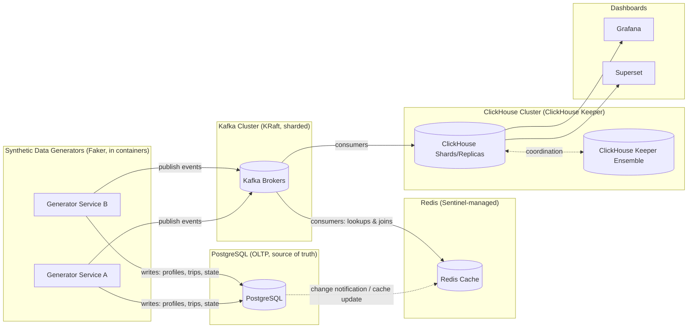
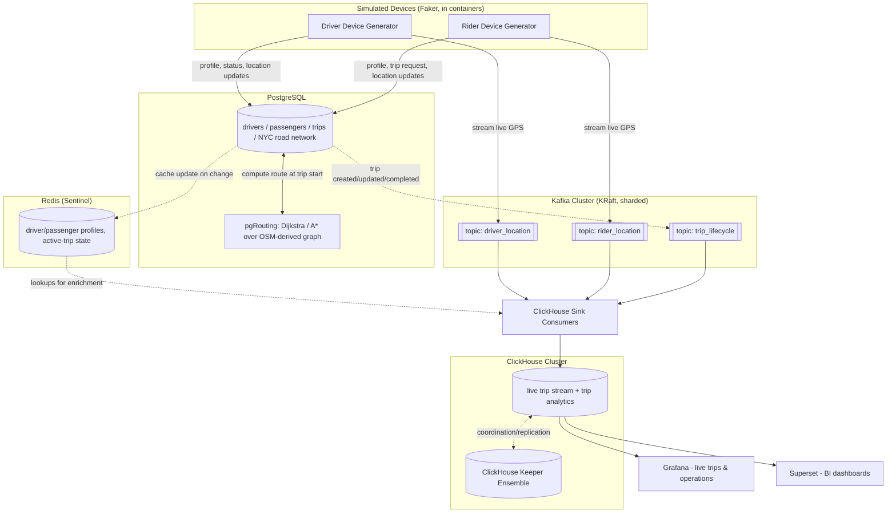

# Meanul Data Studio

## 1. About Meanul Data Studio

Meanul Data Studio is a framework for simulating the **full backend data
lifecycle of an online platform**, end to end, packaged as a set of Docker
containers and run via a single `docker-compose.yml` on a single host.

Each "version" of the studio applies the same architectural pattern to a
different product domain — for example a cab/ride-hailing platform, a
music/video streaming platform (Spotify/Netflix-like), a flight-booking /
airport platform, and so on. The studio is designed to host **multiple such
versions over time**; the pattern itself is domain-agnostic:

- **Synthetic data generation** — All activity (users, drivers, listeners,
  trips, plays, bookings, etc.) is produced by services built with the
  [Faker](https://faker.readthedocs.io/) library, generating realistic,
  internally-consistent records rather than arbitrary random values.
  Generation pacing (volume, rate, time-of-day/weekday/seasonal weighting)
  is config-driven.
- **OLTP layer (PostgreSQL)** — The single source of truth for operational
  state (e.g. driver/passenger/trip tables): a solid, transactional
  database that generators write to.
- **Cache layer (Redis, Sentinel-managed)** — Sits in front of the OLTP
  layer as the **read path for everything else**. ClickHouse-feeding
  consumers and other mimic services must never query the PostgreSQL OLTP
  cluster directly for joins/lookups — they read from Redis instead. When
  data in PostgreSQL changes, PostgreSQL informs the cache so it can be
  updated/invalidated, keeping Redis consistent with the source of truth.
- **Streaming backbone (Kafka cluster, KRaft mode)** — A sharded,
  multi-broker Kafka cluster running in KRaft mode (no ZooKeeper).
  Generators and/or the OLTP layer publish events onto Kafka topics.
- **OLAP layer (ClickHouse, ClickHouse Keeper)** — A sharded/replicated
  ClickHouse cluster fed from Kafka, coordinated via a ClickHouse Keeper
  ensemble (no ZooKeeper dependency).
- **Dashboards** — [Grafana](https://grafana.com/) for live/operational
  views and [Apache Superset](https://superset.apache.org/) for analytical
  BI dashboards, both backed by ClickHouse.

Every component, including the Python generator services, runs inside its
own Docker container — there is no host-level virtual environment; any
Python `venv`s live entirely inside the container images.

## 2. Version 1 — Cab / Ride-Hailing Platform

Version 1 simulates an online cab/ride-hailing platform: drivers and
passengers, trip requests, real-time location streaming during a trip, real
routes over the NYC street network, and the analytics built on top of the
resulting activity.

### Components

- **Driver device generator** and **rider device generator** — two
  independent Faker-based services. They create realistic driver/passenger
  profiles and trip activity, and during an active trip they continuously
  stream simulated GPS positions ("live trip" data) for both the driver's
  and the rider's device, with configurable pacing (volume, rate,
  time-of-day/weekday/seasonal weighting) following the weighted-sampling
  style used in the original config-driven sketch.
- **PostgreSQL** — system of truth for drivers, passengers, trips
  (including pickup point, drop-off point, and the computed route), and the
  NYC road network graph used for routing.
- **Redis (Sentinel)** — caches driver/passenger profiles and active-trip
  state. All lookups needed to enrich streamed events (e.g. resolving a
  driver/trip ID to its current state) are served from Redis, not from
  PostgreSQL directly.
- **Kafka cluster (KRaft, sharded)** — carries live driver/rider location
  streams and trip lifecycle events (created, accepted, started, completed,
  cancelled).
- **ClickHouse cluster (ClickHouse Keeper)** — sharded/replicated analytical
  store, populated via Kafka consumers, holding both the live trip stream
  (for live tracking) and historical/aggregated trip analytics.
- **Grafana** — live/operational dashboards on top of ClickHouse (e.g. live
  trips in progress, current driver positions).
- **Apache Superset** — analytical BI dashboards and reports on top of
  ClickHouse.

### NYC road network & routing

The PostgreSQL OLTP database holds the NYC street network as a routable
graph, used to compute a real route (pickup -> drop-off) for every trip:

- **Source data**: an OpenStreetMap extract for New York City (e.g. via
  Geofabrik or the OSM Overpass API), which provides accurate, freely
  licensed street geometry and metadata for the full road network.
- **Loading**: the OSM extract is imported into PostgreSQL/PostGIS and
  converted into a routable topology using `osm2pgrouting` (or
  `osm2pgsql` + pgRouting's topology functions), producing the standard
  pgRouting `ways` / `ways_vertices_pgr` tables.
- **Routing**: for each trip, pgRouting (Dijkstra or A*) computes the
  shortest/fastest path between the pickup and drop-off vertices; the
  resulting route geometry is stored on the trip record.
- **Indexing**: spatial indexes (GiST on geometry columns) and pgRouting's
  vertex/edge indexes are applied so route lookups remain fast as trip
  volume grows.

### Data flow

### Showcase

_Screenshots of the running system (PostgreSQL data, Grafana dashboards,
Superset dashboards, etc.) will be added here._
