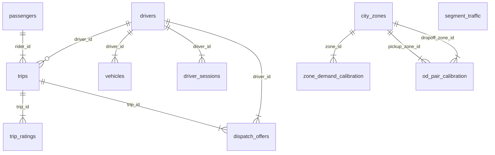

# OLTP entity diagram — version 1

Tables are the ones left after `h-bootstrap/migrations` run in order.
Edges are the foreign keys those migrations declare. A column with
no `REFERENCES` is not drawn, even when the name looks like one.

