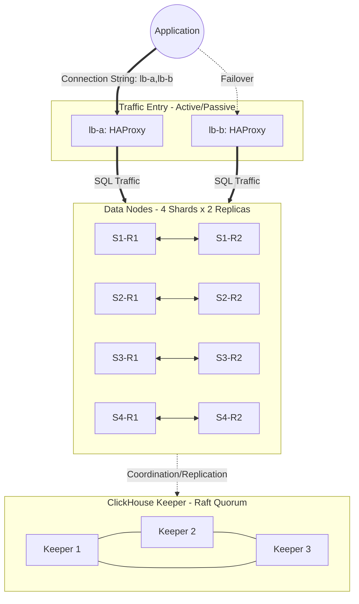

# ClickHouse Distributed Cluster Architecture

## Overview
A highly available, sharded ClickHouse cluster utilizing a 3-node ClickHouse Keeper ensemble for Raft-based coordination. Traffic is distributed via an active-passive HAProxy tier with client-side failover logic.

## Component Breakdown

### 1. Traffic Entry (HAProxy)
* **Count:** 2 instances (`lb-a`, `lb-b`)
* **Per Instance:** 64MB RAM / 0.1 CPU

### 2. Data Layer (ClickHouse)
* **Count:** 8 instances (4 shards $\times$ 2 replicas)
* **Per Instance:** 2GB RAM / 1 CPU

### 3. Coordination Layer (ClickHouse Keeper)
* **Count:** 3 instances
* **Per Instance:** 256MB RAM / 0.25 CPU

## Total Minimum Resource Requirements
To deploy this cluster as part of the stack, the project targets a
dedicated Docker server with **20 CPU cores and 96 GB RAM**. The
ClickHouse-specific minimum is:
* **CPU:** 9 Cores
* **RAM:** 17 GB

## Failover Strategy
The cluster utilizes **Client-Side Failover**. The application must use a connection string containing both HAProxy nodes to ensure high availability:
`jdbc:clickhouse://lb-a:8123,lb-b:8123`

## Architecture Diagram

