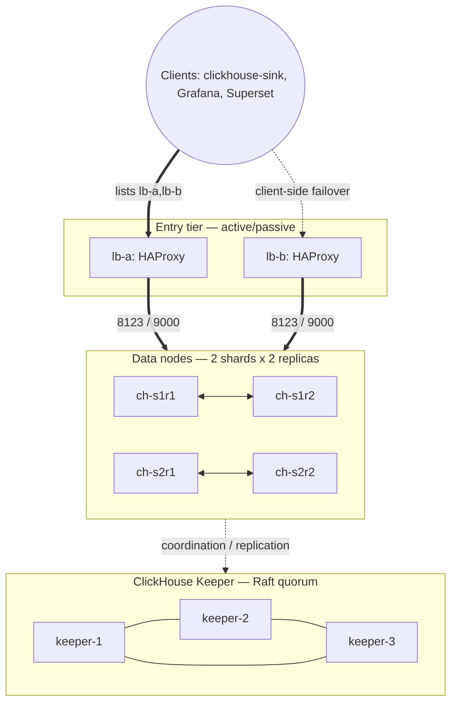

# ClickHouse cluster design (e-infra-clickhouse)

Design notes for the OLAP layer: a **sharded and replicated ClickHouse
cluster (2 shards x 2 replicas)** coordinated by a **3-node ClickHouse
Keeper ensemble** (Raft — no ZooKeeper anywhere in the stack). Both
sharding and replication are demonstrated at a footprint that still fits
one host. Clients enter through the stack-wide HAProxy pair
(`lb-a` / `lb-b`) defined in the root compose file.

The numbers here are the same ones budgeted in the main
[README](../../README.md) section 2.9 — if one changes, both change.

## Components

| Layer | Containers | CPU each | Mem each | Notes |
| --- | --- | --- | --- | --- |
| ClickHouse data nodes | 4 (`ch-s1r1`, `ch-s1r2`, `ch-s2r1`, `ch-s2r2`) | 1.3 | 8 GB | `max_server_memory_usage` set **below** the container limit |
| ClickHouse Keeper | 3 (`ch-keeper-1/2/3`) | 0.1 | 1 GB | Raft quorum; tolerates one loss |
| Entry tier | 2 (`lb-a` / `lb-b`) | 0.1 | 128 MB | stack-wide, defined in the root compose file |

ClickHouse subtotal: **5.2 CPU / 32 GB**, plus **0.3 CPU / 3 GB** for
Keeper.

## Why 2 shards x 2 replicas

CPU, not RAM, is the binding constraint on a 20-core host with no
overcommit (README section 2.9). Four data nodes already consume 5.2 cores
— more than any other component — so a wider cluster would have to shrink
every node's CPU below what an OLAP engine can usefully do with it. Two
shards prove the `Distributed` fan-out and two replicas prove
Keeper-coordinated replication and failover; that is the full lesson,
and buying more shards would cost the parts of the stack that generate
the data.

## Table layout

- Local tables are `ReplicatedMergeTree` with the standard
  `/clickhouse/tables/{shard}/{table}` + `{replica}` path, where `{shard}`
  and `{replica}` come from each node's `macros` config.
- A `Distributed` table over each local table is the query entry point;
  the sharding key is the event's entity id (driver / rider / trip), so a
  single entity's history lands on one shard.
- DDL is applied once with `ON CLUSTER` from a one-shot init container, so
  every node gets the same schema regardless of start order.
- `bootstrap` bulk-loads the seeded historical week; `clickhouse-sink`
  streams everything after that.

## Failover

- **Inside the cluster**: replicas are equal peers. If one node of a shard
  is lost, Keeper keeps the surviving replica authoritative and the
  returning node catches up from the replication log.
- **At the entry tier**: HAProxy balances healthy nodes on 8123 (HTTP) and
  9000 (native); clients list **both** proxies and fail over client-side,
  e.g. `jdbc:clickhouse://lb-a:8123,lb-b:8123`.
- Losing a *whole* shard means losing that shard's data range until it
  returns — a deliberate accepted limit at this footprint, not an
  oversight.

## Architecture

